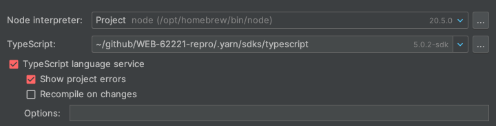
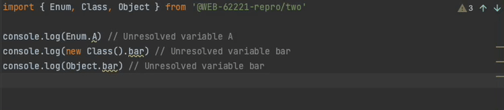

# WEB-62221-repro

1. Install the project:

```bash
yarn install
```

2. Build the project:

```bash
yarn build
```

3. Configure Webstorm to use the patched TypeScript from `.yarn/sdks/typescript`



4. go to `one/src/index.ts`


